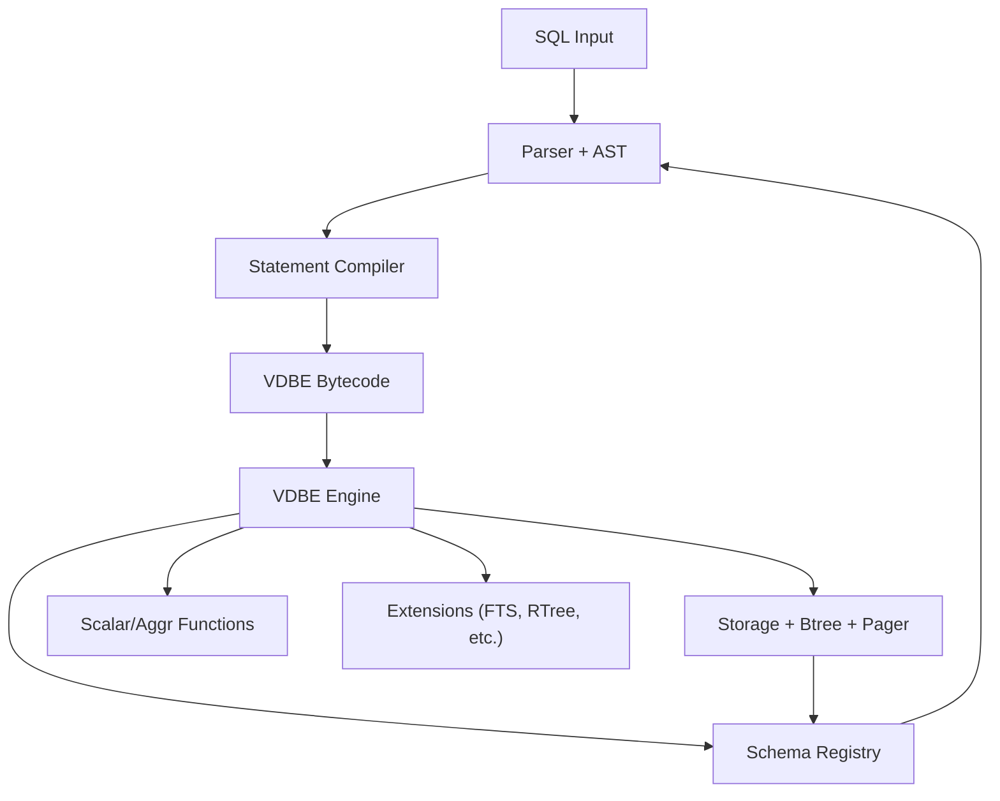
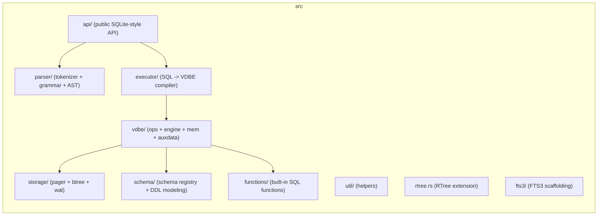
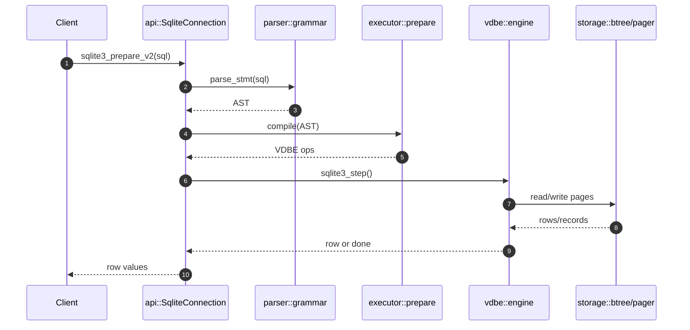
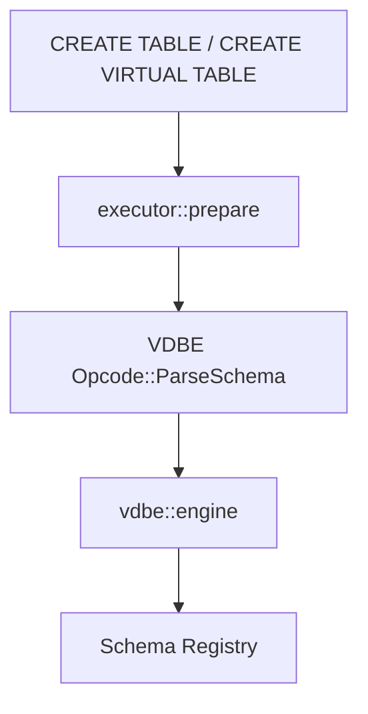
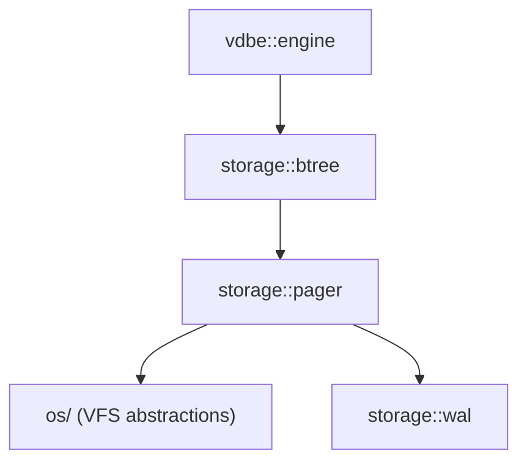
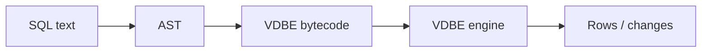
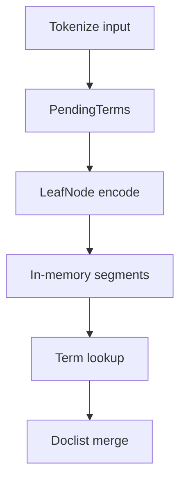
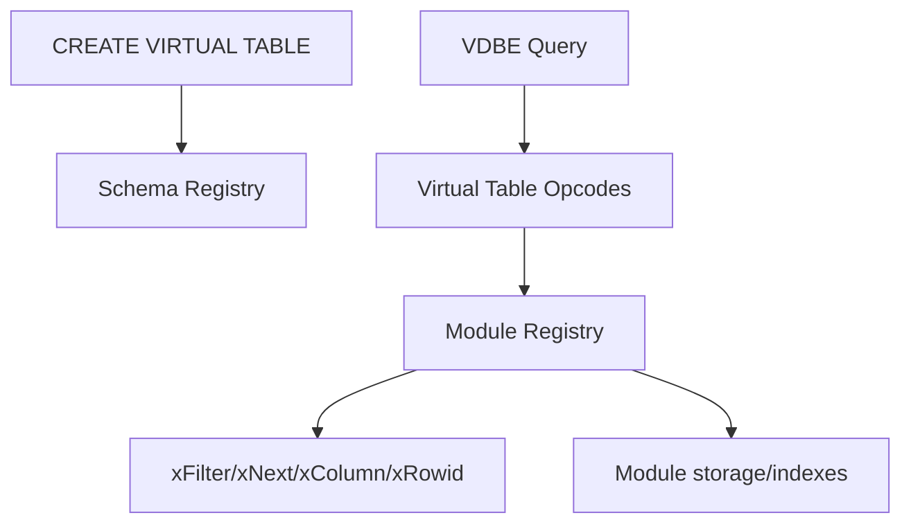
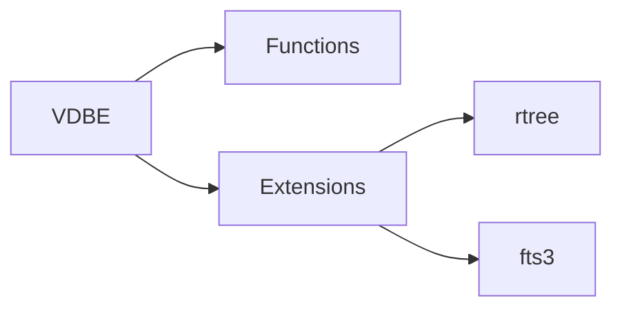

# Architecture Overview

This document summarizes the RustQL architecture and its current state in
plain language. It describes the major building blocks, how a SQL statement
flows through the system, and where SQLite-style features (like virtual tables
and FTS) are partially implemented.

## High-level Map (Plain English)

Think of RustQL as a pipeline:

1) You send SQL text.
2) It gets parsed into a structured form (AST).
3) The compiler turns that structure into a small program (bytecode).
4) The bytecode engine runs that program.
5) The engine reads/writes pages on disk and returns rows.

## Module Layout

What each part does:

- `api/`: The public API that callers use (similar to `sqlite3_*`).
- `parser/`: Turns raw SQL text into an AST (a tree that represents the query).
- `executor/`: Compiles the AST into bytecode (a small instruction list).
- `vdbe/`: The bytecode engine (SQLite calls this the VDBE).
- `storage/`: The page-based storage engine (B-tree + pager + WAL).
- `schema/`: In-memory catalog of tables, columns, indexes.
- `functions/`: Built-in SQL functions (date, math, etc.).
- `fts3/`, `rtree.rs`: Extension-style modules (partial or experimental).

## Query Execution Path

Plain English version:

- `prepare` parses and compiles the SQL.
- `step` runs the bytecode to fetch rows or apply changes.
- Data lives in B-trees, which are loaded from disk pages by the pager.

## DDL and Schema Registration

SQLite-style DDL statements are compiled to VDBE ops that call `ParseSchema`.
The VDBE engine parses the CREATE SQL and updates the in-memory schema.

Notes:
- `CREATE VIRTUAL TABLE` is parsed and registered in schema as a virtual table.
- The runtime virtual-table opcodes (xFilter/xNext/xColumn/xRowid) are not yet
  implemented, so vtab queries are not fully dispatched.

## Storage Subsystem (Simple Mental Model)

SQLite (and RustQL) store data in **pages**. Think of pages as fixed-size
blocks (like 4KB chunks) on disk. A **B-tree** is a tree of these pages.
The **pager** loads pages into memory and writes them back when needed.

## Bytecode (What the Engine Runs)

The compiler emits a list of low-level instructions (bytecode). The VDBE
engine executes them step-by-step. This design makes the execution pipeline
predictable and keeps SQL parsing separate from SQL execution.

## FTS3 Scaffold (Current State)

The FTS3 code is partially translated and lives behind the `fts3` feature.
It currently provides in-memory segment construction and term lookup but is
not yet integrated as a virtual table module.

In plain terms:

- Input text is broken into tokens (words).
- Tokens are grouped into postings (which documents contain the word).
- Postings are stored in segment blocks (compressed lists).
- Queries look up terms and merge these lists.

## Virtual Tables (Planned)

This is the intended shape based on SQLite's pattern. Only the schema part is
implemented today.

## Extension Points

## Open Gaps vs SQLite

- Virtual-table execution opcodes and module registry are missing.
- FTS3 is present as an internal module, but not yet attached to a vtab.
- DDL schema parsing is simplified and does not track all SQLite metadata.

## Architect Readiness (Avoid Stovepipes)

Use this checklist to keep cross-module work aligned and coverage moving:

- Trace changes end-to-end (parser -> executor -> VDBE -> storage) and confirm
  each layer has a test or a clear reason why it cannot be covered.
- When adding or fixing an opcode, verify the compiler emits it in real plans
  and add at least one integration test that exercises the full pipeline.
- For schema/DDL work, validate both schema registration and runtime behavior
  (e.g., prepared statement execution and data access).
- Cross-check `docs/differences.md` for temporary gaps; open or update moths
  when architecture or behavior diverges from SQLite.
- Prefer system-level invariants (correctness, durability, concurrency) over
  local optimizations unless the upstream C path mandates them.

## Glossary

- **AST**: Abstract Syntax Tree. A structured representation of SQL.
- **Bytecode**: A compact instruction list generated from SQL.
- **VDBE**: The bytecode engine that executes SQL.
- **Pager**: Loads and writes pages to disk.
- **B-tree**: The primary on-disk data structure for tables and indexes.
- **WAL**: Write-Ahead Log. A journal for crash-safe writes.
- **Virtual Table**: A table-like interface backed by custom code (not a B-tree).
