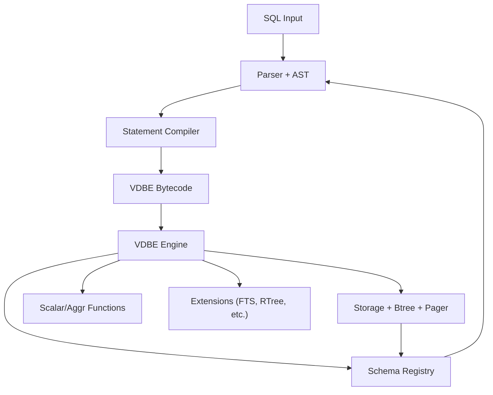
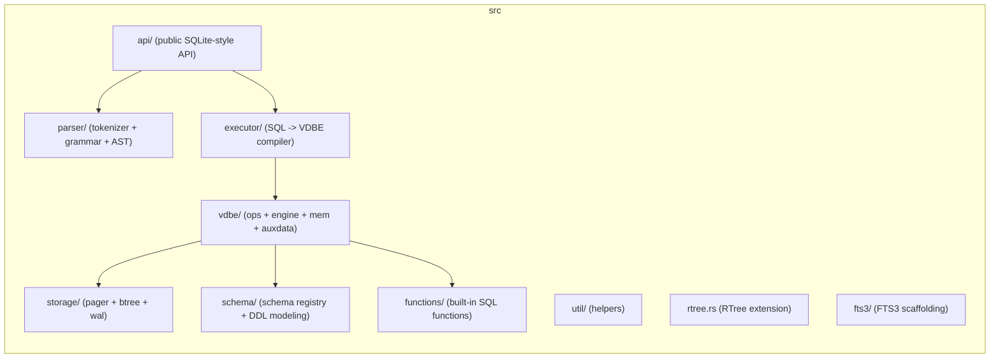
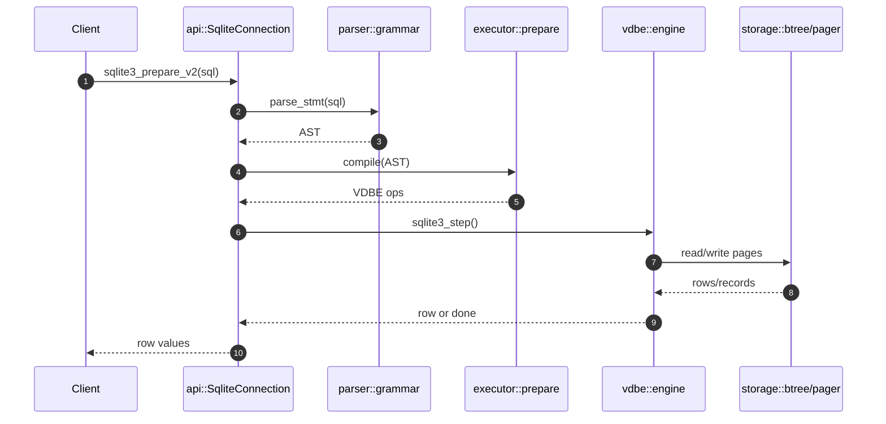
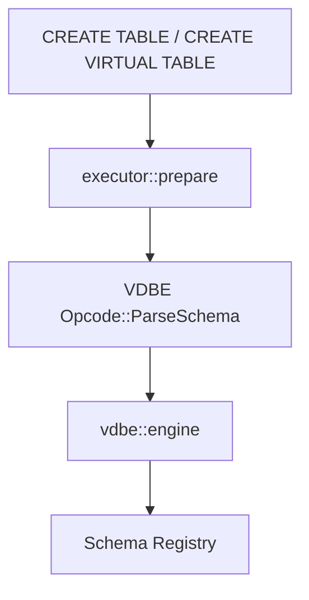
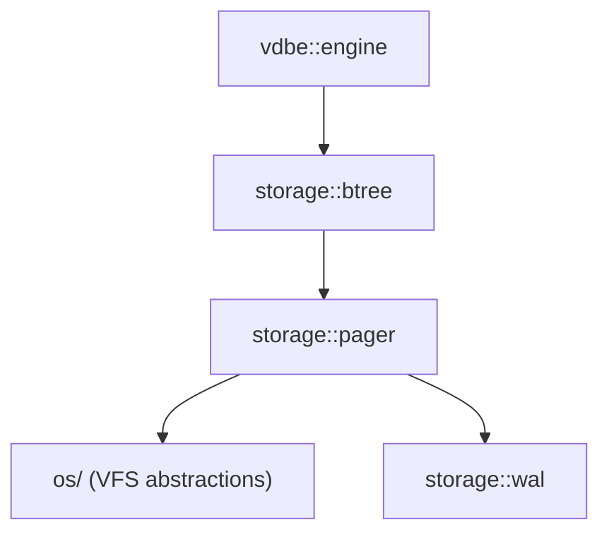
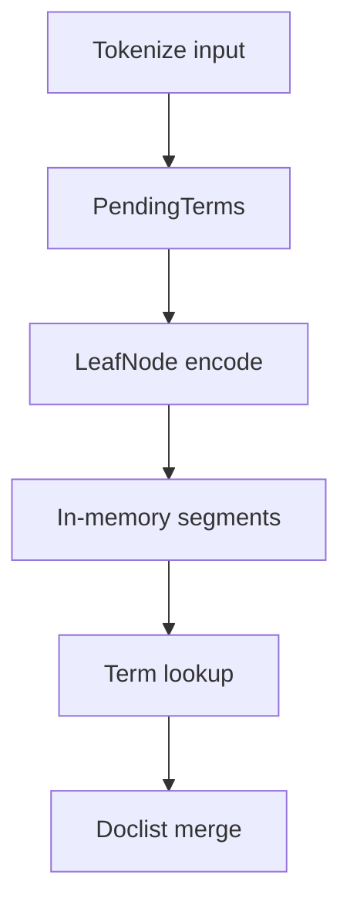
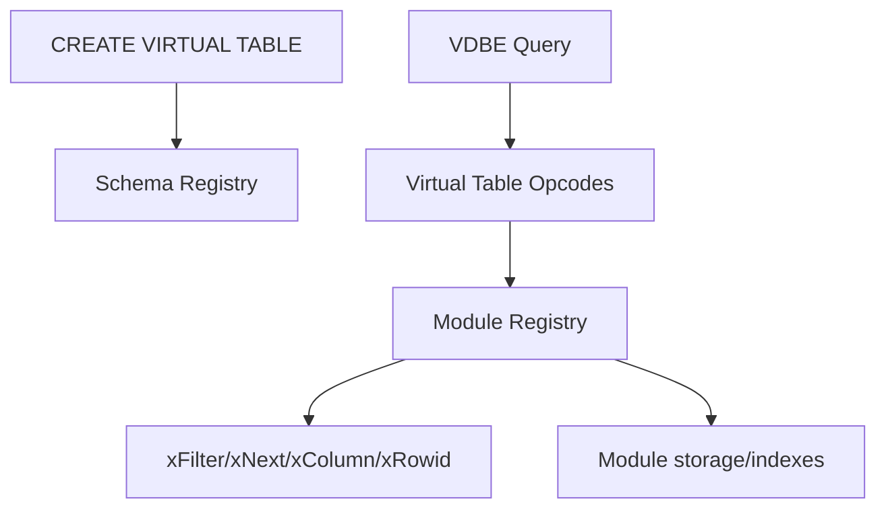
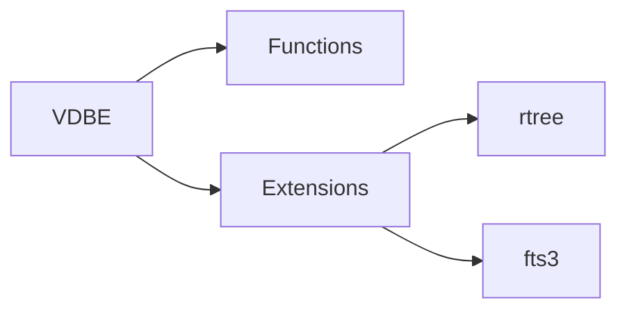

# Architecture Overview

This document summarizes the RustQL architecture and its current state, with
focus on module layout and execution flow. It also highlights where SQLite-like
features (such as virtual tables and FTS) are partially implemented.

## High-level Map

## Module Layout

## Query Execution Path

## DDL and Schema Registration

SQLite-style DDL statements are compiled to VDBE ops that call `ParseSchema`.
The VDBE engine parses the CREATE SQL and updates the in-memory schema.

Notes:
- `CREATE VIRTUAL TABLE` is parsed and registered in schema as a virtual table.
- The runtime virtual-table opcodes (xFilter/xNext/xColumn/xRowid) are not yet
  implemented, so vtab queries are not fully dispatched.

## Storage Subsystem

## FTS3 Scaffold (Current State)

The FTS3 code is partially translated and lives behind the `fts3` feature.
It currently provides in-memory segment construction and term lookup but is
not yet integrated as a virtual table module.

## Virtual Tables (Planned)

This is the intended shape based on SQLite's pattern. Only the schema part is
implemented today.

## Extension Points

## Open Gaps vs SQLite

- Virtual-table execution opcodes and module registry are missing.
- FTS3 is present as an internal module, but not yet attached to a vtab.
- DDL schema parsing is simplified and does not track all SQLite metadata.
