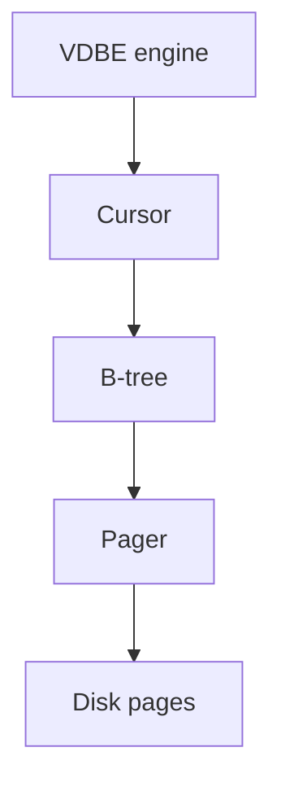
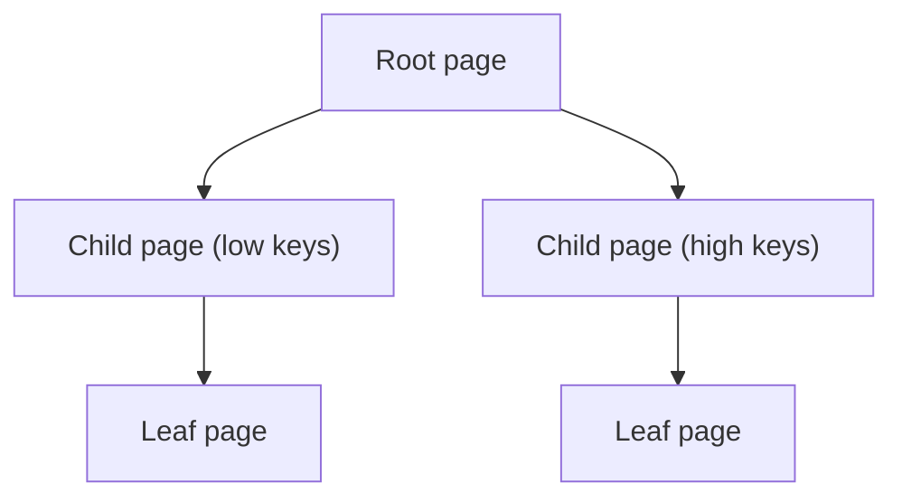
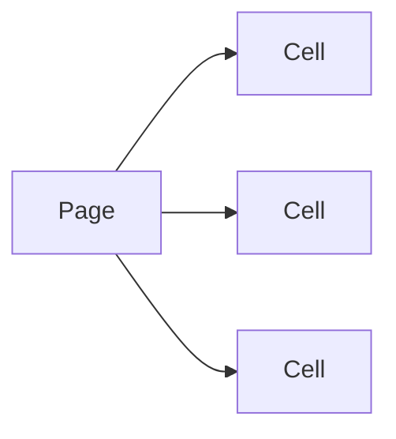
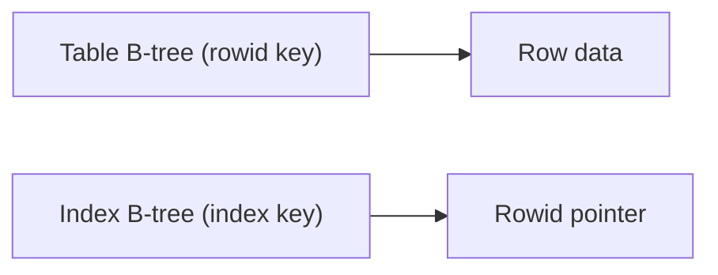
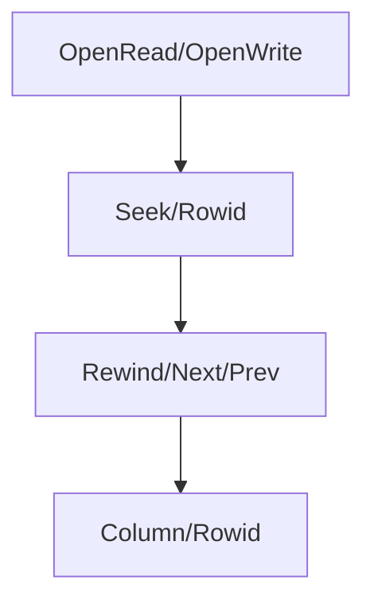
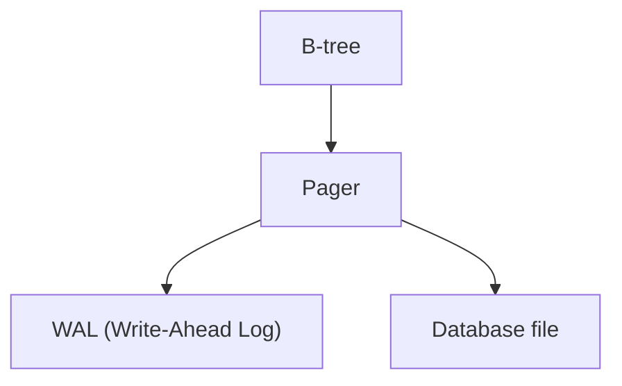

# B-tree Storage Architecture

This document describes the RustQL B-tree layer in plain language. The B-tree
is the on-disk data structure that stores tables and indexes, organized as
pages that can be searched efficiently.

## Mental Model

- Data is stored in fixed-size **pages**.
- Pages are linked in a **B-tree** (a balanced tree).
- The pager reads/writes pages on demand.
- The VDBE uses cursors to traverse the tree.

## What Is a B-tree?

A B-tree keeps data sorted while allowing:

- fast lookups (find a row by key),
- range scans (walk a range of keys),
- inserts and deletes.

Instead of one huge file, the tree is split into **pages** that are linked
together. Each page holds multiple key/value entries.

## Pages and Cells

In SQLite-style B-trees, a page contains **cells**. Each cell is a record or
index entry. Pages can be:

- **Interior pages**: point to child pages.
- **Leaf pages**: store the actual row data (or index keys).

## Tables vs Indexes

- **Tables** are stored as B-trees keyed by `rowid` (integer primary key).
- **Indexes** are stored as B-trees keyed by index columns plus rowid.

## Cursor Operations (How Queries Walk the Tree)

The VDBE opens a cursor on a table or index and uses opcodes like:

- `OpenRead`, `OpenWrite`
- `Rewind`, `Next`, `Prev`
- `SeekGE`, `SeekLE`, `SeekRowid`
- `Column`, `Rowid`, `Insert`, `Delete`

## Pager and WAL (Persistence)

The pager is responsible for:

- loading pages into memory,
- writing dirty pages back to disk,
- coordinating with WAL for crash safety.

## Where to Look in the Code

- `src/storage/btree.rs`: core B-tree operations.
- `src/storage/pager.rs`: page cache and I/O.
- `src/storage/wal.rs`: WAL implementation.
- `src/vdbe/engine.rs`: cursor usage via opcodes.

## Glossary

- **Page**: Fixed-size block on disk (e.g., 4KB).
- **Cell**: An entry stored inside a page.
- **Cursor**: A pointer that moves through B-tree pages.
- **Rowid**: Unique integer key for table rows.
- **WAL**: Write-Ahead Log for crash-safe writes.
