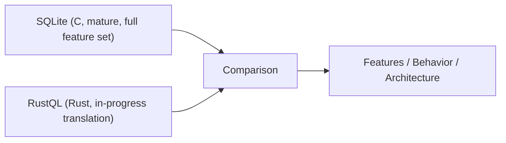
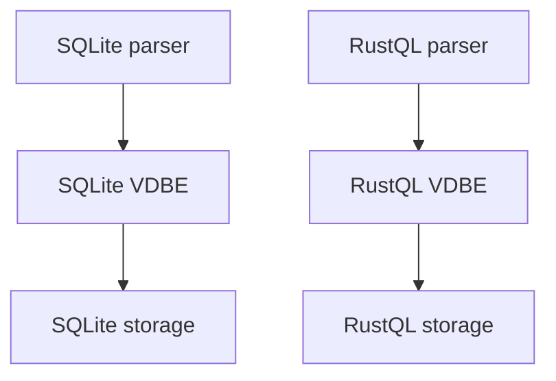
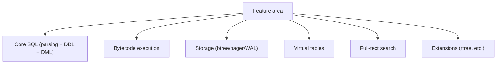

# SQLite vs RustQL (Differences Overview)

This document summarizes how RustQL differs from SQLite today. It focuses on
architecture, feature coverage, and current gaps.

## High-level Comparison

## Goals and Philosophy

- **SQLite**: production-grade, public-domain, decades of optimizations.
- **RustQL**: Rust translation with behavior parity as the goal, but still in progress.

## Architecture Alignment (Same Shape, Different Maturity)

Both systems follow a similar pipeline:

1) Parse SQL.
2) Compile to bytecode.
3) Execute via a bytecode engine.
4) Store data in B-tree pages via a pager.

## Feature Status (Snapshot)

### Core SQL

- SQLite: complete DDL/DML support with extensive edge-case handling.
- RustQL: core DDL/DML supported, but simplified in some places (e.g., schema parsing).

### VDBE / Execution

- SQLite: complete opcode set with full semantics and optimizations.
- RustQL: substantial opcode set implemented, but some opcodes are placeholders.

### Storage

- SQLite: battle-tested btree/pager/WAL with rich recovery paths.
- RustQL: in-progress translation, with some TODOs and simplified behavior.

### Virtual Tables

- SQLite: full virtual table API and runtime opcodes.
- RustQL: schema registration is present, runtime vtab dispatch is not yet implemented.

### Full-text Search (FTS)

- SQLite: FTS3/FTS4/FTS5 fully implemented.
- RustQL: FTS3 scaffold exists but not integrated as a virtual table.

### Extensions

- SQLite: many extensions (rtree, json1, session, etc.) fully supported.
- RustQL: some modules exist (e.g., rtree scaffolding), but coverage is partial.

## Known Behavioral Gaps

- Virtual table execution opcodes are missing.
- FTS modules are not yet wired into SQL.
- Schema parsing is simplified compared to SQLite.
- Some storage code paths are TODO or stubbed.

## Why This Matters

SQLite is the reference behavior; RustQL is intentionally following SQLite's
shape. Differences should be considered **temporary unless explicitly noted**.

## Where to Look

- Architecture: `docs/architecture.md`
- VDBE details: `docs/vdbe.md`
- Storage/B-tree: `docs/btree.md`
