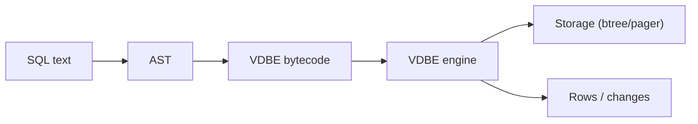
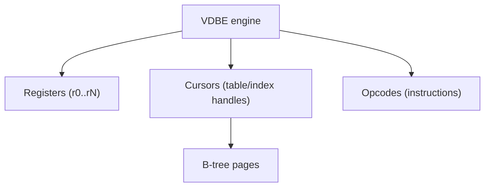

# Virtual Database Engine (VDBE)

This document explains the "virtual database" in RustQL, which mirrors
SQLite's VDBE (Virtual Database Engine). The VDBE is the bytecode
interpreter that actually runs SQL.

## Mental Model

SQL is compiled into a small program (bytecode). The VDBE executes that
program step-by-step, using:

- **Registers**: temporary values used by instructions.
- **Cursors**: handles for tables/indexes.
- **OpCodes**: the instruction set.
- **P1..P5 and P4**: instruction operands (meaning varies per opcode).

## Execution Units

### Registers

Registers hold values (integers, text, blobs, null, etc.). They are used for:

- input parameters,
- intermediate expressions,
- row data before insert/update,
- output columns.

### Cursors

Cursors are open handles to a table or index. They allow the VDBE to:

- seek to a row,
- scan forward/back,
- read columns,
- insert or delete rows.

## Opcode Conventions

Each instruction is an `Opcode` plus operands:

- **P1/P2/P3**: integer operands (varies by opcode).
- **P4**: a typed operand (string, blob, pointer-like data).
- **P5**: a small flag byte for misc behavior.

The actual meaning is defined per opcode in `src/vdbe/ops.rs` and
implemented in `src/vdbe/engine.rs`.

## Opcode Catalog (RustQL)

The list below reflects the current `Opcode` enum. Some opcodes are
implemented in the engine and some are placeholders (no-op or stubbed).
See `src/vdbe/engine.rs` for the runtime behavior.

### Control Flow

| Opcode | Purpose |
| --- | --- |
| `Noop` | Do nothing (placeholder). |
| `Init` | Initialize program state. |
| `Halt` | End of program. |
| `Goto` | Unconditional jump to P2. |
| `If` | Jump to P2 if P1 is true. |
| `IfNot` | Jump to P2 if P1 is false. |
| `Ne` | Jump to P2 if P1 != P3. |
| `Eq` | Jump to P2 if P1 == P3. |
| `Lt` | Jump to P2 if P1 < P3. |
| `Le` | Jump to P2 if P1 <= P3. |
| `Gt` | Jump to P2 if P1 > P3. |
| `Ge` | Jump to P2 if P1 >= P3. |
| `IsNull` | Jump to P2 if P1 is null. |
| `NotNull` | Jump to P2 if P1 is not null. |
| `IfNullRow` | Jump based on three-valued logic. |
| `Gosub` | Call subroutine (save return address). |
| `Return` | Return from subroutine. |
| `EndCoroutine` | End subroutine and set flag. |
| `Yield` | Yield coroutine and jump if done. |

### Register Operations

| Opcode | Purpose |
| --- | --- |
| `Copy` | Copy P1 to P2. |
| `Move` | Move P1 to P2 (P1 becomes null). |
| `SCopy` | Swap registers P1 and P2. |
| `Null` | Store NULL in register P2. |
| `NullRow` | Set null-row mode. |
| `Integer` | Store integer P1 in register P2. |
| `Int64` | Store 64-bit integer in register P2. |
| `Real` | Store real P4 in register P2. |
| `String8` | Store string P4 in register P2. |
| `Blob` | Store blob P4 in register P2. |
| `Variable` | Store bound parameter in register P2. |
| `Add` | Increment register P1 by P2. |
| `Subtract` | P3 = P2 - P1. |
| `Multiply` | P3 = P2 * P1. |
| `Divide` | P3 = P2 / P1. |
| `Remainder` | P3 = P2 % P1. |
| `Concat` | P2 = P1 || P3. |
| `Negative` | P2 = -P1. |
| `Not` | P2 = NOT P1. |
| `BitNot` | P2 = ~P1. |
| `BitAnd` | P3 = P1 & P2. |
| `BitOr` | P3 = P1 | P2. |
| `ShiftLeft` | P3 = P2 << P1. |
| `ShiftRight` | P3 = P2 >> P1. |
| `And` | Short-circuit AND. |
| `Or` | Short-circuit OR. |
| `Cast` | P2 = CAST(P1 AS P4). |
| `Affinity` | Soft cast to an affinity. |

### Comparison Operations

| Opcode | Purpose |
| --- | --- |
| `Compare` | Compare P1 and P3, store result in P2. |
| `Jump` | Jump based on previous Compare result. |
| `Once` | Boolean result of P1 == P3. |
| `Between` | Check if P1 is between P2 and P3. |
| `Like` | Check if P1 matches pattern in P3. |
| `Glob` | Check if P1 matches glob pattern in P3. |
| `Regexp` | Check if P1 matches regexp in P3. |

### B-tree / Table Operations

| Opcode | Purpose |
| --- | --- |
| `OpenRead` | Open cursor P1 on table P2 (read). |
| `OpenWrite` | Open cursor P1 on table P2 (write). |
| `OpenEphemeral` | Open a temp table. |
| `OpenPseudo` | Open a pseudo-table over registers. |
| `OpenAutoindex` | Open autoindex cursor. |
| `Close` | Close cursor P1. |
| `Rewind` | Move cursor P1 to first entry. |
| `Last` | Move cursor P1 to last entry. |
| `Next` | Move cursor P1 forward, jump on end. |
| `Prev` | Move cursor P1 backward, jump on end. |
| `SeekRowid` | Seek cursor P1 to rowid P3. |
| `SeekGE` | Seek cursor P1 to key >= P3. |
| `SeekGT` | Seek cursor P1 to key > P3. |
| `SeekLE` | Seek cursor P1 to key <= P3. |
| `SeekLT` | Seek cursor P1 to key < P3. |
| `SeekNull` | Check for null key in seek. |
| `NotExists` | Jump if cursor P1 not at valid row. |
| `Delete` | Delete row at cursor P1. |
| `ResetSorter` | Reset a sorter cursor. |

### Column / Row Access

| Opcode | Purpose |
| --- | --- |
| `Column` | Read column P2 from cursor P1 into P3. |
| `Rowid` | Read rowid from cursor P1 into P2. |
| `MakeRecord` | Build record from registers. |
| `DecodeRecord` | Decode record into registers. |
| `ResultRow` | Output result row. |
| `Insert` | Insert record into cursor P1. |
| `InsertInt` | Insert record with int key. |
| `NewRowid` | Generate a new rowid. |

### Index Operations

| Opcode | Purpose |
| --- | --- |
| `IdxGE` | Seek index P1 using key in P3. |
| `IdxGT` | Seek index P1 using key in P3. |
| `IdxLE` | Seek index P1 using key in P3. |
| `IdxLT` | Seek index P1 using key in P3. |
| `IdxRowid` | Read rowid from index cursor. |
| `IdxInsert` | Insert into index cursor. |
| `IdxDelete` | Delete from index cursor. |

### Aggregation Operations

| Opcode | Purpose |
| --- | --- |
| `AggStep` | Aggregate step. |
| `AggFinal` | Aggregate final. |
| `AggStep0` | Accumulator step. |
| `AggValue` | Read accumulator value. |

### Sorting Operations

| Opcode | Purpose |
| --- | --- |
| `SorterInsert` | Insert into sorter. |
| `SorterSort` | Sort accumulated rows. |
| `SorterNext` | Fetch next sorted row. |
| `SorterData` | Extract data from sorter. |
| `SorterCompare` | Compare sorter keys. |

### Schema Operations

| Opcode | Purpose |
| --- | --- |
| `CreateBtree` | Create a new btree table. |
| `ParseSchema` | Parse CREATE SQL and add to schema. |
| `DropSchema` | Remove table/index from schema. |

### Transaction Operations

| Opcode | Purpose |
| --- | --- |
| `Transaction` | Begin transaction. |
| `AutoCommit` | Commit transaction. |
| `Savepoint` | Start a savepoint. |
| `ReadCookie` | Read schema cookie. |
| `SetCookie` | Write schema cookie. |
| `VerifyCookie` | Verify schema cookie. |

### Function Operations

| Opcode | Purpose |
| --- | --- |
| `Function` | Call scalar function. |
| `Function0` | Call aggregate step function. |

### Miscellaneous

| Opcode | Purpose |
| --- | --- |
| `Trace` | Trace message (debug). |
| `Explain` | Explain query plan info. |
| `SqlExec` | Execute nested SQL. |
| `Checkpoint` | Check for interrupt. |
| `FinishSeek` | Finish expression evaluation. |
| `SortKey` | Sort key comparison. |
| `Sequence` | Sequence value for autoincrement. |
| `Count` | Count rows. |

### Foreign Key Operations

| Opcode | Purpose |
| --- | --- |
| `FkCounter` | Increment/decrement deferred FK counter. |
| `FkIfZero` | Jump if deferred FK counter is zero. |
| `FkCheck` | Check immediate FK constraints. |

### Trigger Operations

| Opcode | Purpose |
| --- | --- |
| `Program` | Execute trigger subprogram. |
| `Param` | Access OLD/NEW parameter from parent VDBE. |
| `TriggerTest` | Test if trigger should fire. |
| `TriggerProlog` | End of trigger prolog. |
| `MaxOpcode` | Sentinel (not executed). |

## Implementation References

- `src/vdbe/ops.rs`: Opcode enum and basic metadata.
- `src/vdbe/engine.rs`: Runtime execution behavior.
- `src/vdbe/mem.rs`: Register/value representation.
- `src/storage/*`: B-tree and pager implementation.
